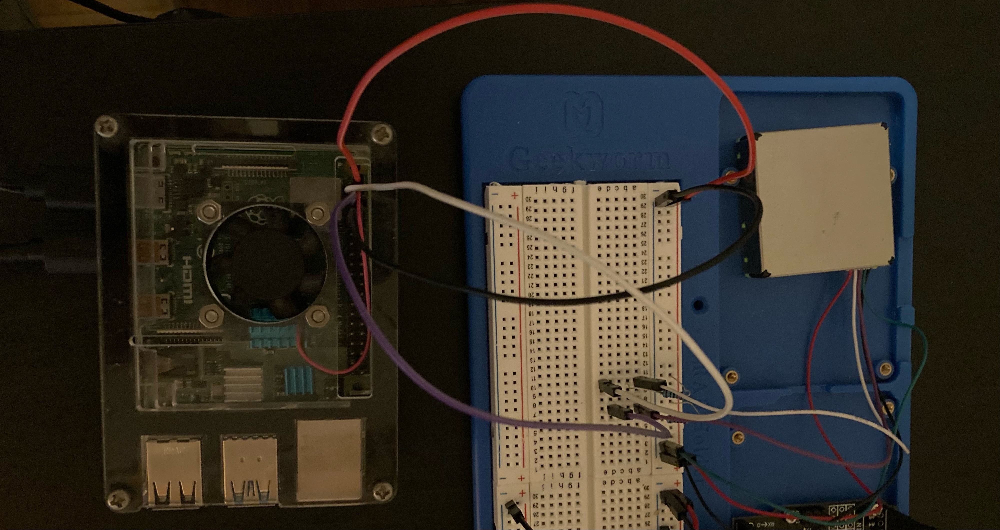

# Connect the Sensor

For this piece you can follow the exact instructions from [the inspiration project](https://www.hackster.io/david-gherghita/air-quality-monitor-using-raspberry-pi-4-sps30-and-azure-03cb42#code).  In my case I already had a fan writed to pins 4 and 6 so I used 2 and 9 for the sensor.  

Here's what it ends up looking like:
