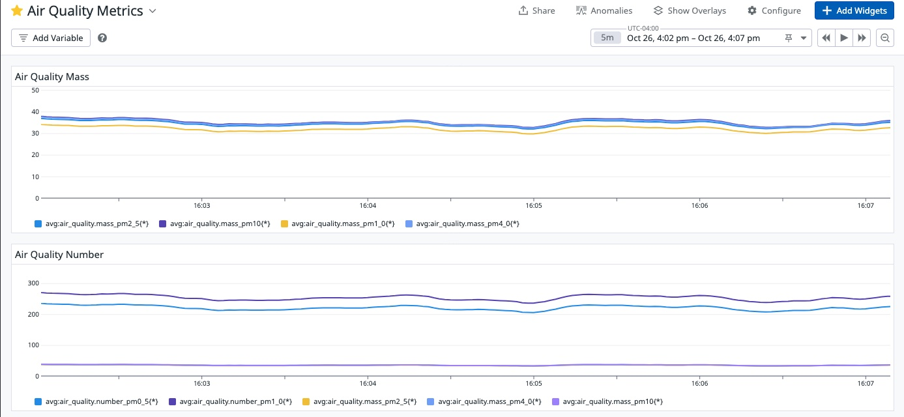

# Submit Metrics to Datadog

Working out a few kinks here, still requires manual hookup of IO devices (mouse, keyboard, screen) to the Raspberry PI to login as root.

## Execute the Rust binary

The binary will give you the air quality data metric payload and the response from the Datadog API as stdout.  Here's an example of a successful submission:

```bash
Air quality data: AirInfo { mass_pm1_0: 38.90991, mass_pm2_5: 42.083652, mass_pm4_0: 42.86556, mass_pm10: 43.25561, number_pm0_5: 268.4069, number_pm1_0: 308.6405, number_pm2_5: 310.38068, number_pm4_0: 310.62778, number_pm10: 310.71844, typical_size: 0.46319675 }
Tags: [("product_type", "00080000"), ("serial_number", "84C61058764AFD26"), ("firmware_version", "2.3")]
Metrics response: IntakePayloadAccepted {
    errors: Some(
        [],
    ),
    additional_properties: {},
    _unparsed: false,
}
```

### As `root` user on Raspberry Pi

Once you have logged in, you can submit the metrics directly as root user by running:

```bash
ENV=prod DD_SITE="datadoghq.com" DD_API_KEY="$DATADOG_API_KEY" sps30-metrics
```

### Log in via SSH

For now, you need to update the password from the root user via manual connection to the device (e.g. `sudo passwd pi`).  Then you can SSH into the device from a workstation on the same WLAN network you configured via the build machine env vars.  In the [AWS Terraform example](../build/clouds/) these are set in the `wifi_*` inputs.

#### On target device (as `root`)
1. Update the password for the `pi` user and grant I2C permissions.

    ```bash
    sudo passwd pi
    ...
    sudo chmod 666 /dev/i2c*
    ```

#### On workstation
1. Find the IP of the Raspberry pi using a tool like [nmap](https://nmap.org/)  (e.g. `nmap -sn 192.168.1.0/24`)
2. Configure trust to the target machine on your workstation:

    ```bash
    ssh-keyscan -t rsa <DEVICE_IP> >> ~/.ssh/known_hosts
    ```
3. Login to the device `ssh pi@<TARGET_IP>`
4.  Generate the metrics

    ```bash
    export $(grep -v '^#\|^$' /etc/environment | xargs) && \
     ENV=prod DD_SITE="datadoghq.com" DD_API_KEY="$DATADOG_API_KEY" sps30-metrics
    ```

### Query and Visualize the metrics

Example metric query dashboard:



JSON snippet of the dashboard config:
- [View on GitHub](docs/assets/dashboard.json)
- [Download raw JSON](https://raw.githubusercontent.com/cahillsf/rpi-particulate-sensor/main/docs/config/assets/dashboard.json)

### TODO
- fix EXTRA_USERS password settings and guidance
- autogrant I2C permissions to pi user